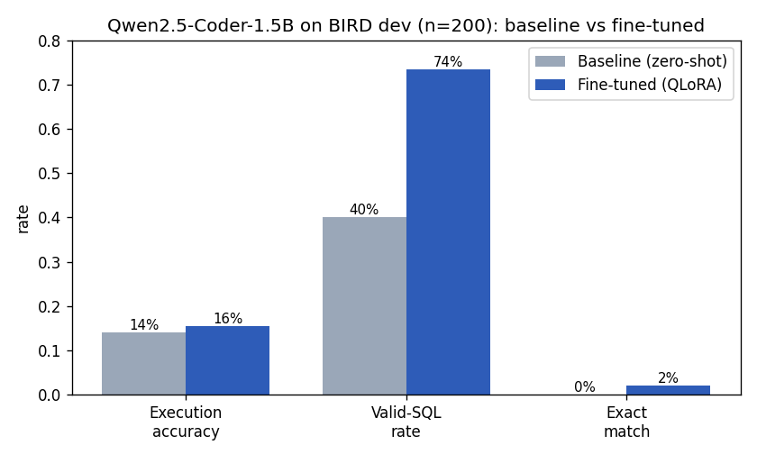

# Text2SQL — Fine-tuning a ≤3B LLM for SQL generation

Fine-tune a small (≤3B) open-source LLM so a non-technical user can ask a
question in plain English — *"Who were the top performing merchants last
quarter?"* — and get back an **executable SQL query**. Built to run entirely on
**free resources** (Google Colab T4, open datasets, open models).

This repo contains the **complete pipeline** — dataset exploration →
preprocessing → QLoRA fine-tuning → inference → execution-based evaluation — plus
the experiment design and a written report.

> **TL;DR model choice:** [`Qwen2.5-Coder-1.5B-Instruct`](https://huggingface.co/Qwen/Qwen2.5-Coder-1.5B-Instruct)
> (1.54B params, **Apache-2.0**, code-specialised) fine-tuned with **QLoRA** via
> **Unsloth** on **BIRD**, evaluated by **execution accuracy** on a real SQLite DB.
>
> **TL;DR result:** on 200 BIRD-dev questions, fine-tuning lifted the **valid-SQL
> rate 40% → 73.5%** (EX 14.0% → 15.5%). See [Results](#results).

---

## Why these tools (all free / open-source)

| Need | Choice | Why |
|---|---|---|
| Base model (≤3B) | **Qwen2.5-Coder-1.5B-Instruct** | Strong code/SQL prior, Apache-2.0, fits free T4. 0.5B for the "smaller is better" ablation; 3B is `license:other`. |
| Efficient fine-tuning | **QLoRA + Unsloth** | 4-bit base + LoRA adapters → trains on a single 16 GB T4; ~2× faster, ~50% less VRAM than vanilla PEFT. |
| Training loop | **TRL `SFTTrainer`** | Standard, well-supported SFT; completion-only loss masking. |
| Datasets | **BIRD** + **SynSQL-2.5M** (subset) | BIRD ships real SQLite DBs → enables *execution* accuracy. SynSQL adds cross-domain scale (2.5M, 16k DBs). Both Apache-2.0. |
| Eval | **sqlite3** (stdlib) | Execution accuracy = run gold vs. pred, compare result sets. |
| Compute | **Google Colab (T4)** | Free GPU; the training notebook is Colab-ready. |

See [`report/REPORT.md`](report/REPORT.md) for the full reasoning.

---

## Repository layout

```
text2sql-finetuning/
├── src/
│   ├── config.py        # dataclass config + experiment presets
│   ├── schema_utils.py  # reconstruct/serialize SQLite schemas for prompts
│   ├── prompts.py       # prompt + chat-message construction; SQL extraction
│   ├── data_prep.py     # BIRD / SynSQL / HF  ->  standardized JSONL
│   ├── train.py         # QLoRA SFT (Unsloth, PEFT fallback)
│   ├── inference.py     # batch generate SQL from question + schema
│   └── evaluate.py      # execution accuracy / valid-SQL / exact match
├── notebooks/
│   ├── 01_data_exploration.ipynb   # analyze datasets, save figures
│   ├── 02_finetune_qlora.ipynb     # Colab T4 training (end-to-end)
│   └── 03_inference_eval.ipynb     # baseline vs fine-tuned + error analysis
├── scripts/
│   ├── make_sample_data.py  # tiny synthetic fintech DB + BIRD-format examples
│   └── smoke_test.py        # no-GPU, no-download end-to-end pipeline test
├── data/sample/             # bundled fintech DB so everything runs offline
├── report/
│   ├── REPORT.md            # the written report (source of the PDF)
│   └── build_pdf.py         # REPORT.md -> report/REPORT.pdf (fpdf2)
├── requirements.txt
└── README.md
```

---

## Quickstart

```bash
git clone https://github.com/Shiverion/text2sql-finetuning.git
cd text2sql-finetuning
```

### Run it on Google Colab or Kaggle (free T4)
Open `notebooks/02_finetune_qlora.ipynb` → enable the GPU runtime → *Run all*.
The first cell clones this repo into the session automatically; no manual upload
needed. Then run `notebooks/03_inference_eval.ipynb` in the same session to score.

- **Colab:** Runtime → Change runtime type → **T4 GPU**.
- **Kaggle:** Settings → Accelerator → **GPU T4 x2**, and **Internet → On**.

**Fits Kaggle's 19 GB disk.** Training only needs schema *text*, not databases,
so the pipeline builds train schemas from BIRD's small `train_tables.json`
(`data_prep --tables_json …`) and **skips the ~8 GB `train_databases` download**.
Only `dev_databases` (~1.3 GB) is fetched, for execution-accuracy eval. Big zips
download to `/tmp` (scratch, off the working-disk quota) and are deleted after
extraction.

### 0. Verify the pipeline with zero setup (CPU, no downloads)
The data/prompt/evaluation logic runs on the Python **standard library** only:

```bash
python scripts/smoke_test.py
```
This builds a synthetic fintech database, preprocesses it, and proves the
execution-evaluation scores gold queries at 100% EX and catches broken ones.

### 1. Explore the data
Open `notebooks/01_data_exploration.ipynb` (falls back to the bundled sample if
BIRD isn't downloaded). Figures are written to `report/figures/`.

### 2. Fine-tune (Google Colab, free T4)
Open `notebooks/02_finetune_qlora.ipynb` → *Runtime → T4 GPU* → run all. It
installs Unsloth, downloads BIRD, preprocesses, and trains `exp1`. Or via CLI on
any CUDA machine:

```bash
pip install -r requirements.txt   # plus the Unsloth git install (see notebook)

python -m src.data_prep --source bird --json train/train.json \
    --db_root train/train_databases --out data/processed/bird_train.jsonl --shuffle
python -m src.train --preset exp1_qwen1.5b_bird_qlora \
    --train_file data/processed/bird_train.jsonl --max_train_samples 8000 --epochs 2
```

### 3. Inference + evaluation
```bash
python -m src.inference --model_dir outputs/exp1 \
    --input data/processed/bird_dev.jsonl --output outputs/preds_ft.jsonl --limit 200
python -m src.evaluate --pred outputs/preds_ft.jsonl --report outputs/metrics_ft.json
```

### 4. Build the report PDF
```bash
python report/build_pdf.py        # -> report/REPORT.pdf
```

---

## Experiments

| # | Model | Data | Recipe | Question it answers |
|---|---|---|---|---|
| **Baseline** | Qwen2.5-Coder-1.5B (no FT) | — | zero-shot | How much does fine-tuning actually add? |
| **Exp 1** | Qwen2.5-Coder-1.5B | BIRD train | QLoRA r=16, 2 ep | Main run. |
| **Exp 2** | Qwen2.5-Coder-**0.5B** | BIRD train | same recipe | Does a *smaller* model still work? (brief rewards small) |
| **Exp 3** | Qwen2.5-Coder-1.5B | BIRD + SynSQL subset | QLoRA, 1 ep | Does extra cross-domain data help generalization? |

Each is a one-line preset in [`src/config.py`](src/config.py). Full rationale and
results in the [report](report/REPORT.md).

---

## Results

**Experiment 1** (Qwen2.5-Coder-1.5B + BIRD, QLoRA) — fine-tuned on a free Kaggle
T4, evaluated on **200 BIRD-dev** questions. Adapter:
[`Shiverion/qwen2.5-coder-1.5b-bird-qlora`](https://huggingface.co/Shiverion/qwen2.5-coder-1.5b-bird-qlora).

| Run | Execution acc. (EX) | Valid-SQL rate | Exact match |
|---|---|---|---|
| Baseline (1.5B, zero-shot) | 14.0% | 40.0% | 0.0% |
| **Exp 1 (1.5B + BIRD, QLoRA)** | **15.5%** | **73.5%** | **2.0%** |

**Headline: fine-tuning nearly doubled the valid-SQL rate (40% → 73.5%)** — the
model learned to emit clean, executable, schema-grounded SQL (the brief's
priority). EX gains are modest, as expected for a small/quick run. EX by
difficulty: simple 21.9%, moderate 7.4%, challenging 0%. Executed notebook +
metrics in [`results/`](results/); full analysis in [`report/REPORT.md`](report/REPORT.md).



---

## Metrics

- **Execution accuracy (EX)** — predicted SQL runs *and* returns the same result
  set as the gold query (order-insensitive). The metric that matters for the
  use-case ("rewarded if executable").
- **Valid-SQL rate** — fraction that executes without error.
- **Exact match** — normalized string equality (strict lower bound).

## Limitations
The model is intentionally small and time-boxed, so it is **not** production
accurate — see the report's *Weaknesses & Improvements* section (schema linking,
self-consistency decoding, execution-guided decoding, scaling data). Generated
SQL should be **read-only and sandboxed** before ever touching a real database.
